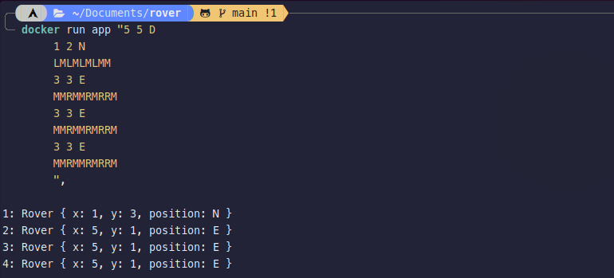

# Rover Project
CLI tool evaluating rovers position

## Use
For those without cargo, run the following from within the root directory of this project:
```
docker build -t app .
```

After creating the docker container, run the following:

```
docker run app $ARG
```

Where $ARG represents the required rover input for an arbitrary N amount of rovers as demonstrated below:

